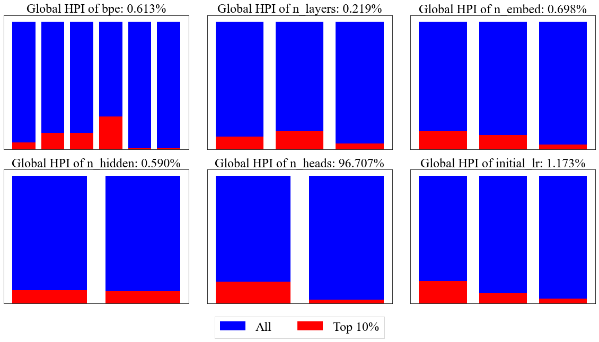
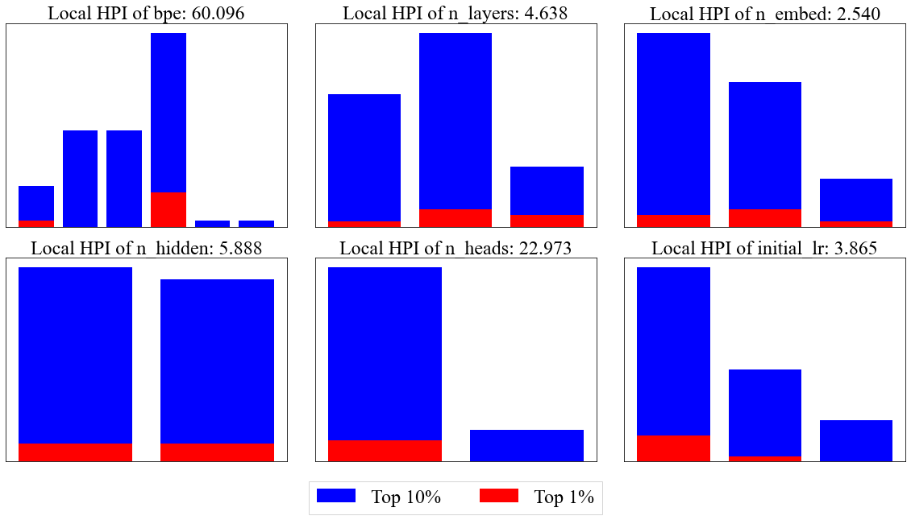
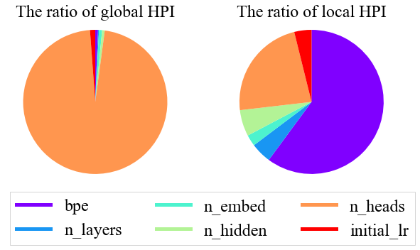
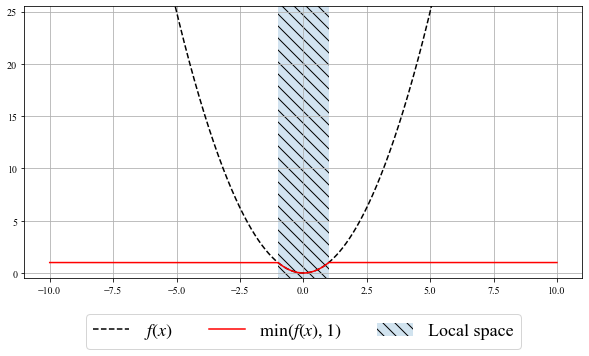

## f-ANOVA for local space

This library aims to figure out which parameters are important depending on the phase of optimizations.

This repository is based on the paper `Revisiting Hyperparameter Importance Assessment: Local Importance from the Lebesgue View`.


## Motivation

The key insight of our method is the fact that hyperparameter importance (HPI) depends on the definition of search space, but it has not been investigated how to define local search space.

For example, we use [NMT-Bench](https://github.com/Este1le/hpo_nmt) as a target example.
We first calculate the global HPI ( $\gamma = 0.1$ ) using our method and then obtain the following result (We normalized the HPI so that the sum of HPI becomes 100%).
According to this result, the HPI of `n_heads` is dominant as it takes up 96.7% of importance.



On the other hand, if we limit the search space to the top-10% domain,
we obtain the following HPI ( $\gamma^\prime = 0.01$ ):



Furthermore, the ratios of HPIs for each calculation are the following:



It just implies that even though we need to tune intensively tune `n_heads` to obtain the top-10% performance, the most important hyperparameter for the top-1% is not `n_heads`, but `bpe`.

To better-tune hyperparameters, we need to gain insight into which hyperparameters to focus at each phase of optimizations.
Our method tackles such an issue.

**NOTE**

The distinct difference from applying f-ANOVA to the only top-10% data
is that while f-ANOVA takes the integral over the whole search space,
**our method takes the integral only over the local search space**, which requires some mathematics.
The consequence of this change is to avoid the dilution caused by considering the whole search space.

For example, a straightforward way to measure the importance is to apply f-ANOVA to a function $g(x) := \min(f(x), y^\star)$ where $y^\star$ is a user-defined parameter.
Here is an example using $f(x) = x^2$ and $y^\star = 1$.
If we just compute the f-ANOVA, we calculate the following:
$
\mu_{\mathrm{old}} = \frac{1}{20}\int_{-10}^{10} g(x) dx = \frac{1}{20}\biggl(\frac{2}{3} + 18 \biggr) = \frac{14}{15}  \\
\sigma_{\mathrm{old}}^2 = \frac{1}{20}\int_{-10}^{10} (g(x) - \mu)^2 dx = \frac{1}{20} \biggl(\frac{2}{5} + 18 \biggr) -\mu^2 = \frac{11}{225} \simeq 0.04889\dots.
$
However, if we apply the f-ANOVA only to the local space $[-1, 1]$, the result is completely different:
$
\mu_{\mathrm{new}} = \frac{1}{2}\int_{-1}^1 f(x) dx = \frac{1}{3} \\
\sigma_{\mathrm{new}}^2 = \frac{1}{2}\int_{-1}^1 (f(x) - \mu)^2 dx = \frac{1}{5} -\mu^2 = \frac{4}{45} \simeq 0.08888\dots.
$
More generally, if we define the bounds as $[-L, L]$ where $L > 1$,
it could be written as follows:
$
\mu_{\mathrm{old}} = \frac{1}{2L}\int_{-L}^{L} g(x) dx = \frac{1}{2L}\biggl(\frac{2}{3} + 2(L - 1) \biggr) = 1 - \frac{2}{3L}  \\
\sigma_{\mathrm{old}}^2 = \frac{1}{2L}\int_{-L}^{L} (g(x) - \mu)^2 dx = \frac{1}{2L} \biggl(\frac{2}{5} + 2(L - 1) \biggr) -\mu^2 = \frac{4}{3}\biggl( \frac{2}{5L} - \frac{1}{3L^2} \biggr).
$
This example implies that clipping functions, which is quite conventional, is biased depending on the search space design, i.e. $L$ in this example.
On the other hand, our method yields unbiased variance for any definitions of the search space.




## Install

First, install the dependency.

```shell
$ pip install -r requirements.txt
```

Run this test:

```shell
$ python example.py
```

## Citation

Please cite the following paper (later):
Paper under double-blind review.
